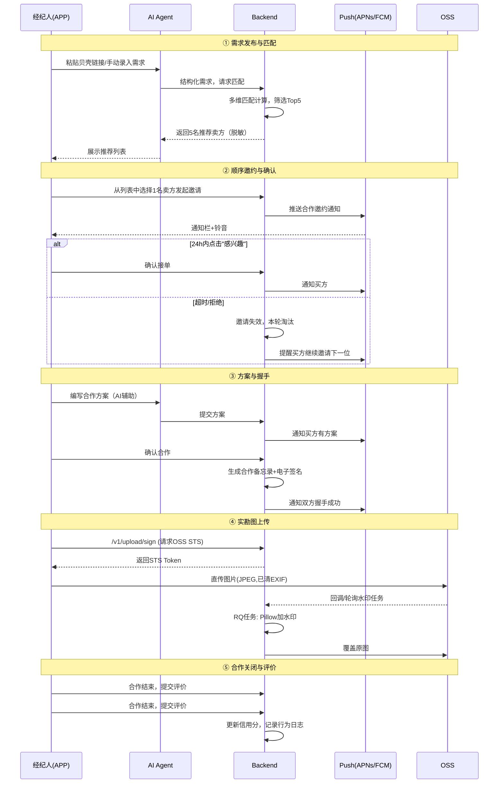
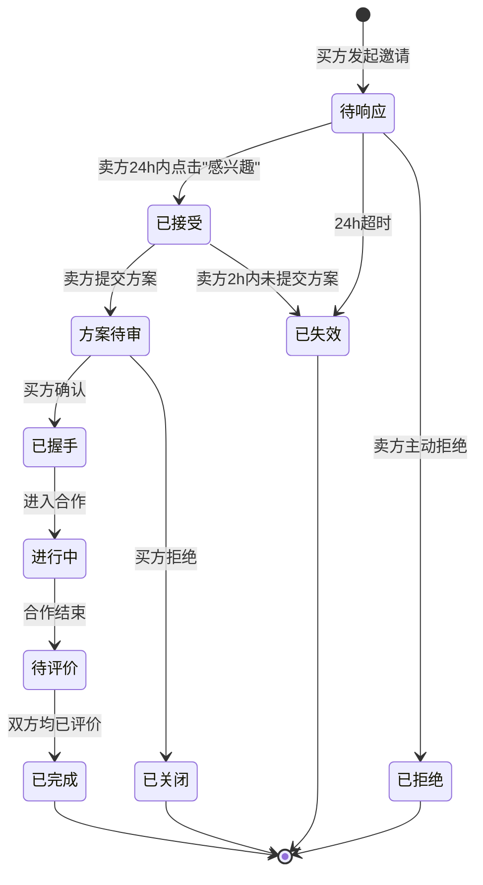

# HomeMatch — 北京二手房独立经纪人撮合评价平台 MVP 需求文档

| 项目代号 | **HomeMatch** |
| --- | --- |
| 文档版本 | **v0.4（登录调整为微信为主，先验证后上线）** |
| 撰写日期 | 2026-06-04 |
| 来源 | 整合自 3 份原始资料 + 平台变更决策 |
| 状态 | ✅ v0.3 平台切换；v0.4 登录以微信为主，新增 D-021 开发模式验证 |

---

## 0. 速览（TL;DR）

HomeMatch 是面向**北京独立二手房经纪人**的轻量级联卖平台。每个经纪人可同时作为买方/卖方经纪人，平台通过**智能匹配 → 顺序邀约 → 方案握手 → 双向评价**完成一个最小合作闭环。MVP **不涉及交易、不分账、不绑定独家**，仅沉淀角色与行为证据链。

**v0.3 平台变更**：用户端从"微信小程序"切换到**原生 APP（iOS + Android，Flutter 跨端）**。Web 后台仍保留作为运营/审核端。

**核心理念**：对标贝壳 ACN 的信息联卖效率，但不强制分边分佣；用 AI Agent 赋能单兵作战的独立经纪人。

---

## 1. 项目背景与定位

### 1.1 问题
- 独立经纪人之间**房客源匹配效率低**
- 合作**信任成本高**（房源真实性、响应及时性、分账预期）

### 1.2 解决方案
- 以 **AI Agent** 为协作中枢，赋能单兵作战的独立经纪人
- 借鉴贝壳 ACN（Agent Cooperate Network）的协作逻辑，但**适配独立经纪人场景**
- **贝壳找房链接**作为信息增强输入（AI 自动解析→预填表单），降低录入成本

### 1.3 设计原则
- **无独家、无锁定**：房源/客户不被平台独家绑定
- **非竞合、1对1邀请制**：每轮只邀请 1 名卖方，避免多方哄抢
- **MVP 不分账**：仅记录证据链与信用，沉淀未来分边数据
- **移动 APP 优先**：iOS + Android 双端原生体验（Flutter 实现），Web 后台辅助

---

## 2. 用户角色

| 角色 | 简介 | 核心能力 |
| --- | --- | --- |
| **买方经纪人** | 拥有购房客户 | 发布需求、查看推荐、发起邀请、确认方案、合作后评价 |
| **卖方经纪人** | 拥有可售房源 | 维护房源、响应邀请、提交方案、合作后评价 |
| **AI Agent** | 供需双方的内置助理 | 贝壳链接解析、需求匹配 Top5、方案生成辅助、评价异常检测、信用计算 |
| **平台运营**（Web 后台） | 平台内部 | 经纪人审核、举报处理、评价管理、数据看板、版本发布 |

> 每个独立经纪人可同时充当买方和卖方两个角色。运营通过 Web 后台操作。

---

## 3. MVP 核心功能

### 3.1 房源录入（卖方经纪人）

| 功能点 | 描述 |
| --- | --- |
| 贝壳链接解析 | 粘贴贝壳找房房源链接 → AI 提取小区/户型/面积/挂牌价/图片等 → 预填表单 |
| 手动补录 | 必填：小区、户型、面积、总价、核心标签、可看时间 |
| 实勘水印图 | 拍照/选图 → 客户端预压缩 + 清除 EXIF → 服务端加双层水印（[D-010](00-decisions.md#d-010)） |
| 真实性承诺 | 必须勾选"已实勘且真实在售" |
| 自动校验 | 价格偏离市场均价 **±30%** → 标记"需核实"；24 小时内未补全 → 房源冻结 |

### 3.2 需求发布（买方经纪人）

| 功能点 | 描述 |
| --- | --- |
| 贝壳链接解析 | 客户指定房 → AI 转化为"精准需求 + 相似宽松需求" |
| 手动发布 | 必填：区域、总价区间、户型、购房资质、看房时间偏好 |
| AI 需求摘要卡 | 脱敏后用于匹配展示 |

### 3.3 智能匹配与推荐

- 输入：买方需求
- 多维匹配因子：**区域 / 价格 / 户型 / 看房时间 / 信用分 / 活跃度**
- 输出：**Top 5 卖方经纪人**（按匹配度降序）
- 展示内容（脱敏）：区域、户型、报价、合作信用分、历史成交量
- 买方经纪人可点击查看任一卖方的**详情和历史评价**

### 3.4 合作邀请与确认（非竞合模式）

```
买方从 Top 5 选 1 人发起邀请
        ↓
系统生成《合作邀约》（双方角色声明 + 房源/需求信息）
        ↓
卖方须在 24 小时内点击"感兴趣"
        ↓
        ├── 确认接单 → 进入"方案沟通"阶段
        └── 超时未响应 / 主动拒绝 → 邀请失效，卖方本轮淘汰
                                    → 买方继续邀请下一位
```

> 淘汰是"本轮"性质（[D-001](00-decisions.md#d-001)），下轮重新计算推荐。

### 3.5 合作方案提交与握手

```
卖方确认接单（24h 内）
        ↓
卖方须在 2 小时内提交《合作匹配方案》
  - 契合点分析
  - 建议看房安排
  - 业主情况
  （可借助 AI 模板）
        ↓
买方收到方案
        ↓
        ├── 确认合作 → 双方 Agent 自动生成《合作备忘录》→ 电子签名 → 握手成功 → 合作 ID 建立
        └── 拒绝方案 → 邀请关闭，可重新发起
```

### 3.6 评价与信用体系

| 维度 | 规则 |
| --- | --- |
| 评价时机 | 合作结束（成交 / 终止）后，双方**必须**互评 |
| 评价形式 | 1-5 星 + 文字评论 |
| 可见性 | **双方互评实名可见，第三方脱敏**（[D-004](00-decisions.md#d-004)） |
| 异常检测 | AI 识别刷分、恶意评价、模板化好评 |
| 信用分公式 | `基础分(均分×20) × 活跃系数`（[D-002](00-decisions.md#d-002)） |
| 淘汰规则 | • 虚假房源 → **一票冻结**（最严）<br>• 15 天无维护 → 房源下架<br>• 多次不响应 / 恶意抢单 → 降权 |

### 3.7 通知中心

| 事件 | 推送策略 | 通道 |
| --- | --- | --- |
| 收到新邀请 | 即时通知栏 | APNs / FCM |
| 邀请超时前 2h 提醒（卖方） | 通知栏 | APNs / FCM |
| 收到新方案 | 即时通知栏 | APNs / FCM |
| 方案超时前 30min 提醒（买方） | 通知栏 | APNs / FCM |
| 合作状态变化 | 静默数据消息 | APNs / FCM |
| 评价请求 | 即时通知栏 | APNs / FCM |
| 平台公告 | 通知栏 | APNs / FCM |

> 推送方案见 [D-014](00-decisions.md#d-014)。

---

## 4. 核心业务流程（时序图）



### 4.1 邀请状态机



---

## 5. 核心数据模型（10 张表）

> 详细字段 SQL 见 [schemas/](schemas/)（待生成）。v0.3 新增 3 张表：`devices`、`app_versions`、`event_logs`。

| # | 表 | 关键字段 | 备注 |
| --- | --- | --- | --- |
| 1 | **users** | id, phone_encrypted, phone_hash, apple_user_id, wechat_unionid, name, credit_score, rating_avg, activity_count_30d, status | v0.3: 加 apple_user_id / wechat_unionid |
| 2 | **properties** | id, seller_id, community, layout, area, total_price, tags[], images[], source_url, status | |
| 3 | **demands** | id, buyer_id, district, price_range, layout, qualification, viewing_time, source_url, status | |
| 4 | **invitations** | id, demand_id, buyer_id, seller_id, status, created_at, expired_at, responded_at | |
| 5 | **proposals** | id, invitation_id, content, submitted_at | |
| 6 | **cooperations** | id, invitation_id, buyer_id, seller_id, status, memo_content, signed_at, closed_at | |
| 7 | **reviews** | id, cooperation_id, reviewer_id, rating, comment, created_at | |
| 8 | **devices** | id, user_id, fcm_token, platform (ios/android), app_version, last_active_at | 🆕 v0.3 |
| 9 | **app_versions** | id, platform, latest_version, min_supported_version, force_update, release_notes, download_url | 🆕 v0.3 |
| 10 | **event_logs** | id, user_id, event_name, event_data(JSONB), app_version, platform, created_at | 🆕 v0.3 |

**辅助表**：
- `audit_logs`（append-only）：所有关键操作的时间戳+操作人+动作
- `agent_messages`：AI Agent 对话历史（用于训练/调优）
- `community_prices`：小区均价缓存（用于价格偏离校验）

---

## 6. 关键页面（6 个核心 + 5 个支持）

### 6.1 核心页面

| # | 页面 | 核心元素 |
| --- | --- | --- |
| 1 | **APP 启动 + 登录** | Splash 动画 / 版本检查 / 短信验证码 / Apple 登录 / 微信登录 |
| 2 | **买方需求发布页** | 贝壳链接输入+解析 / 手动录入表单（区域、价格滑块、户型、资质、看房时间）/ 需求摘要卡 / 提交 |
| 3 | **卖方房源录入页** | 贝壳链接解析 / 字段自动填充+编辑 / 标签选择器 / 实勘图拍照+选图（自动压缩清 EXIF） / 真实承诺勾选 |
| 4 | **匹配推荐页** | 需求摘要固定顶部 / 5 名卖方卡片（头像/信用分/匹配度/房源关键信息） / "邀请合作"按钮 / 邀请状态 |
| 5 | **邀请响应页（卖方）** | 新邀请列表（带倒计时） / "感兴趣"按钮 / 历史邀请区 |
| 6 | **合作看板** | 进行中合作列表+状态流转 / 历史合作 / 评价入口 |

### 6.2 支持页面

| # | 页面 | 核心元素 |
| --- | --- | --- |
| 7 | **个人中心** | 头像/姓名/信用分/历史评价数/设置入口 |
| 8 | **我的房源** | 房源列表/编辑/下架 |
| 9 | **我的需求** | 需求列表/编辑/关闭 |
| 10 | **通知中心** | 系统通知/合作通知/评价通知 |
| 11 | **设置** | 通知开关/清除缓存/隐私政策/关于 |

> 详细线框图与 Flutter Widget 树见 [RD/prototypes/](RD/prototypes/)（待生成）和 [docs/04-ui-ux-guidelines.md](04-ui-ux-guidelines.md)。

---

## 7. 非功能性需求

| 类别 | 要求 |
| --- | --- |
| **性能** | 需求发布到 Top 5 推荐 < 3s；推送延迟 < 5s；APP 冷启动 < 2s |
| **可用性** | 核心链路 ≥ 99.5%（MVP 阶段） |
| **可观测** | Sentry（错误+性能）+ 自建事件日志（业务） + 关键操作审计 |
| **可扩展** | 后端服务函数可平滑重构为 LangGraph Node（二期） |
| **合规** | 经纪人实名（手机号/微信授权）+ 房源/需求脱敏展示 + 证据链留痕 |
| **可移植** | Docker 化部署，PG/Redis 可平滑上云 |
| **AI 防护** | LLM 调用限流、降级、人工确认兜底 |
| **APP 体验** | 启动 < 2s / 帧率 ≥ 50fps / 列表滑动流畅 / 暗色模式 / 离线缓存 / 弱网降级 |
| **APP 安全** | HTTPS Only / 证书固定（cert pinning）/ 敏感字段加密 / 防越权 |

---

## 8. 技术栈（v0.3 我的判断版）

> **v0.3 关键变化**：用户端从 WeChat MP 切换到 **iOS + Android 双端（Flutter 跨端）**。

| 层次 | 选型 | v0.3 变更与理由 |
| --- | --- | --- |
| **后端语言** | Python 3.11+ | 不变 |
| **后端框架** | FastAPI | 不变 |
| **数据库** | PostgreSQL 15 | 不变 |
| **缓存** | Redis 7 | 不变 |
| **任务队列** | RQ | 不变 |
| **状态机** | `transitions` 库或纯枚举 | 不变 |
| **ORM** | SQLAlchemy 2.0 + Alembic | 不变 |
| **用户端 APP** | **Flutter 3.x（Dart 3）** | 🆕 **v0.3 切换**：一码双端，原生体验 |
| **状态管理（APP）** | **Riverpod 2.x** | 🆕 配套 Flutter 推荐 |
| **路由（APP）** | **go_router** | 🆕 声明式路由，支持 Deep Link |
| **网络层（APP）** | **dio + retrofit** | 🆕 拦截器统一处理 token / 错误 |
| **本地存储（APP）** | Hive / Isar | 🆕 列表缓存、设置 |
| **推送** | **APNs（iOS）+ FCM（Android）** | 🆕 **v0.3 新增**，替代 WeChat 模板消息 |
| **管理后台** | Vue 3 + Element Plus | 不变 |
| **匹配引擎** | PG（tsvector + GIN + 物化视图） | 不变 |
| **AI 主力** | DeepSeek-V3 | 不变 |
| **AI 兜底** | Claude / GPT-4o | 不变 |
| **文件存储** | 阿里云 OSS + **STS 直传** | 🆕 APP 不经过后端中转 |
| **认证** | 短信验证码 + Apple 登录 + 微信登录 + JWT | 🆕 **v0.3 切换** |
| **错误监控** | Sentry（APP+后端） | 不变 |
| **限流** | slowapi + Redis 滑动窗口 | 不变 |
| **CI/CD** | GitHub Actions + **fastlane**（iOS/Android） | 🆕 fastlane 自动化打包 |
| **部署** | Docker → 二期 K8s | 不变 |
| **配置** | pydantic-settings | 不变 |
| **依赖管理** | uv（Python）+ pubspec（Flutter） | 不变 |
| **测试** | pytest（后端） + flutter_test（APP） + Playwright（Web） | 🆕 补 flutter_test |

### 8.1 明确**不**上 / 二期再说
- ❌ LangGraph（**二期**再说）
- ❌ Elasticsearch（**二期**再说）
- ❌ 微信小程序 / Taro（**本期不做**）
- ❌ 独立 IM 通讯（用 APNs/FCM 推送代替）
- ❌ 支付 / 分账
- ❌ 多租户 / SaaS 化
- ❌ Android 厂商推送聚合（华为/小米/OPPO/vivo）—— 用户量起来再做

---

## 9. MVP 不做清单（明确边界）

| 不做 | 原因 |
| --- | --- |
| 支付与分账 | 合作达成后由双方线下结算，平台只留证据 |
| 独立 IM 通讯 | 用推送（APNs/FCM）+ 系统分享代替 |
| 多城市 | 北京二手房规则特殊，MVP 只做北京 |
| 经纪公司账号 | 用户群体限定"独立经纪人" |
| 房源核验（线下实勘审核） | 靠"实勘承诺勾选"+"用户举报"，MVP 不做平台级核验 |
| 视频带看 / VR | 重资产，MVP 不做 |
| 关注功能 | MVP 不做社交关系链 |
| 平台审核 | MVP 仅手机号注册，二期再加资质审核 |
| 分边调度算法 | 二期才需要 |
| 自动调解纠纷 | 二期 LangGraph 才可能 |
| 完整离线 | MVP 仅列表缓存 + 详情只读 |
| Android 厂商推送 | 用户量起来再做（华为/小米/OPPO/vivo 各自通道） |

---

## 10. ✅ 开放问题拍板结果（截至 v0.3）

> 详细方案见 [docs/00-decisions.md](00-decisions.md)。

### 10.1 v0.2 已拍板（11 个）

| # | 问题 | 决定 | ADR |
| --- | --- | --- | --- |
| Q1 | 邀请淘汰范围 | 本轮不可见 | [D-001](00-decisions.md#d-001) |
| Q2 | 信用分公式 | `基础分(均分×20) × 活跃系数` | [D-002](00-decisions.md#d-002) |
| Q3 | 市场均价数据 | 自建 `community_prices` | [D-003](00-decisions.md#d-003) |
| Q4 | 评价可见性 | 双方实名，第三方脱敏 | [D-004](00-decisions.md#d-004) |
| Q5 | 经纪人审核 | MVP 仅手机号 | [D-005](00-decisions.md#d-005) |
| Q6 | 主体类型 | 公司主体 | [D-006](00-decisions.md#d-006) |
| Q7 | 关注功能 | 不做 | [D-007](00-decisions.md#d-007) |
| Q8 | LLM 预算 | Soft ¥2000 / Hard ¥5000 | [D-008](00-decisions.md#d-008) |
| Q9 | 贝壳链接 | MVP 降级为手动粘贴 | [D-009](00-decisions.md#d-009) |
| Q10 | 水印规则 | 双层水印 | [D-010](00-decisions.md#d-010) |
| Q11 | 敏感加密 | 手机号 AES-256 | [D-011](00-decisions.md#d-011) |

### 10.2 v0.3 新增拍板（9 个 APP 相关）

| # | 问题 | 决定 | ADR |
| --- | --- | --- | --- |
| Q12 | 移动端框架 | **Flutter 3.x** | [D-012](00-decisions.md#d-012) |
| Q13 | APP 认证 | **微信为主** + Apple 登录（iOS 必须）+ 短信兜底 | [D-013](00-decisions.md#d-013) |
| Q14 | 推送 | APNs + FCM | [D-014](00-decisions.md#d-014) |
| Q15 | APP 分发 | TestFlight + Firebase/蒲公英 | [D-015](00-decisions.md#d-015) |
| Q16 | 强制更新 | 软提示 + 硬阻断 | [D-016](00-decisions.md#d-016) |
| Q17 | 图片处理 | 客户端压缩 + 清 EXIF + 服务端水印 | [D-017](00-decisions.md#d-017) |
| Q18 | 离线支持 | 列表缓存 + 详情只读 | [D-018](00-decisions.md#d-018) |
| Q19 | Deep Link | Universal Link + App Link | [D-019](00-decisions.md#d-019) |
| Q20 | 埋点监控 | Sentry + 自建事件日志 | [D-020](00-decisions.md#d-020) |
| Q21 | 资质阻塞 | **MVP 不阻塞，用开发模式验证** | [D-021](00-decisions.md#d-021) |

---

## 11. 变更记录

| 版本 | 日期 | 变更 |
| --- | --- | --- |
| v0.1 | 2026-06-04 | 初稿，整合 3 份原始资料 + 我的判断 |
| v0.2 | 2026-06-04 | 11 个开放问题全部拍板 |
| **v0.3** | **2026-06-04** | **平台切换：WeChat MP → iOS/Android APP（Flutter）；新增 9 条决策；新增 devices / app_versions / event_logs 表；新增 02-architecture.md / 03-api-spec.md / 04-ui-ux-guidelines.md 配套文档** |
| v0.4 | 2026-06-04 | 登录调整为**微信为主**；新增 D-021 MVP 不阻塞开发；新增 docs/00-summary.md 大白话摘要；资质申请业务侧并行启动 |
